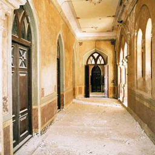
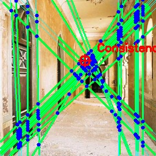
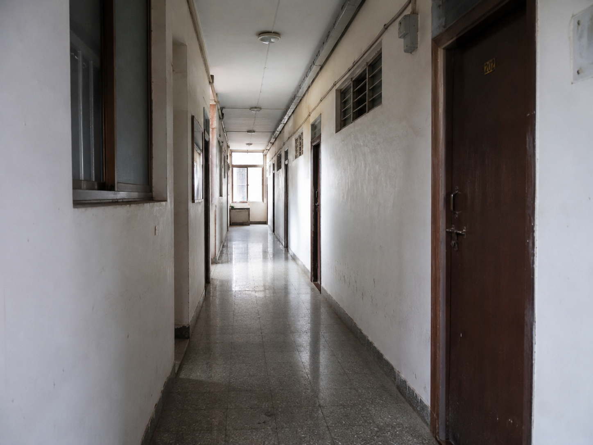
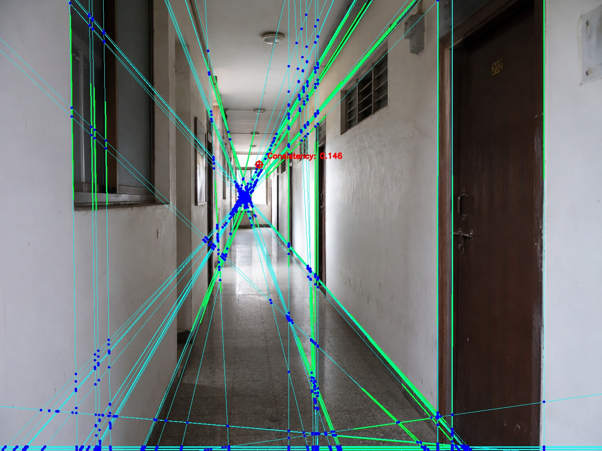

# AI Image Forensics Tool

A computer vision-based forensic tool that distinguishes **AI-generated images** from **real photographs** using **geometric consistency analysis**.

Instead of relying on deep learning, this project analyzes perspective geometry within an image by detecting structural lines, estimating vanishing points, and measuring how consistently those lines converge. The resulting consistency score is used to classify an image as **Real** or **AI-Generated**.

---

## Features

- Perspective line detection using OpenCV
- Vanishing point estimation
- Geometric consistency scoring
- Real vs AI image classification
- FastAPI REST API
- Visual forensic analysis output

---

## How It Works

```text
Input Image
      ↓
Edge Detection
      ↓
Line Detection (Hough Transform)
      ↓
Line Filtering & Clustering
      ↓
Vanishing Point Estimation
      ↓
Consistency Score
      ↓
Real / AI Classification
```

---

# Real Image Example

### Input Image



### Geometric Analysis Output



### Result

```json
{
  "message": "Analysis complete",
  "lines_detected": 25,
  "vanishing_point": [205, 265],
  "consistency_score": 0.653,
  "prediction": "real"
}
```

The detected architectural lines converge consistently toward a dominant vanishing point, producing a high geometric consistency score.

---

# AI Image Example

### Input Image



### Geometric Analysis Output



### Result

```json
{
  "message": "Analysis complete",
  "lines_detected": 12,
  "vanishing_point": [184, 197],
  "consistency_score": 0.081,
  "prediction": "ai"
}
```

The image exhibits weaker geometric consistency, resulting in a significantly lower score and AI classification.

---

## Dataset

Evaluation was performed on a balanced dataset of **200 images**.

| Category       | Real    | AI      |
| -------------- | ------- | ------- |
| Corridors      | 20      | 20      |
| Classrooms     | 20      | 20      |
| Libraries      | 15      | 15      |
| Offices        | 15      | 15      |
| Computer Rooms | 15      | 15      |
| Bookstores     | 15      | 15      |
| **Total**      | **100** | **100** |

AI images were generated using modern image generation models including ChatGPT Images, Gemini, and Flux.

---

## Results

### Performance Metrics

| Metric            | Value     |
| ----------------- | --------- |
| Overall Accuracy  | **82.5%** |
| Decision Accuracy | **86.4%** |
| Coverage          | **95.5%** |
| AI Detection Rate | **99%**   |

### Confusion Matrix

| Actual | Predicted AI | Predicted Real |
| ------ | -----------: | -------------: |
| Real   |           25 |             66 |
| AI     |           99 |              1 |

---

## Installation

Clone the repository:

```bash
git clone https://github.com/Pushkar026/ai-image-forensics.git

cd ai-image-forensics
```

Create a virtual environment:

```bash
python -m venv venv
```

Activate environment:

### Windows

```bash
venv\Scripts\activate
```

### Linux / macOS

```bash
source venv/bin/activate
```

Install dependencies:

```bash
pip install -r requirements.txt
```

---

## Running the Backend

```bash
cd backend

uvicorn main:app --reload
```

Server:

```text
http://127.0.0.1:8000
```

---

## Example Request

```python
import requests

with open("image.jpg", "rb") as image:

    response = requests.post(
        "http://127.0.0.1:8000/analyze",
        files={
            "file": image
        }
    )

print(response.json())
```

---

## Example Response

```json
{
  "message": "Analysis complete",
  "lines_detected": 25,
  "vanishing_point": [205, 265],
  "consistency_score": 0.653
}
```

---

## Tech Stack

- Python
- OpenCV
- NumPy
- FastAPI
- Uvicorn

---

## Future Improvements

- Multiple vanishing point detection
- Noise-based forensic analysis
- Frequency-domain analysis
- Larger evaluation datasets
- Hybrid geometric and statistical forensic model

---

## Author

**Pushkar Yadav**
